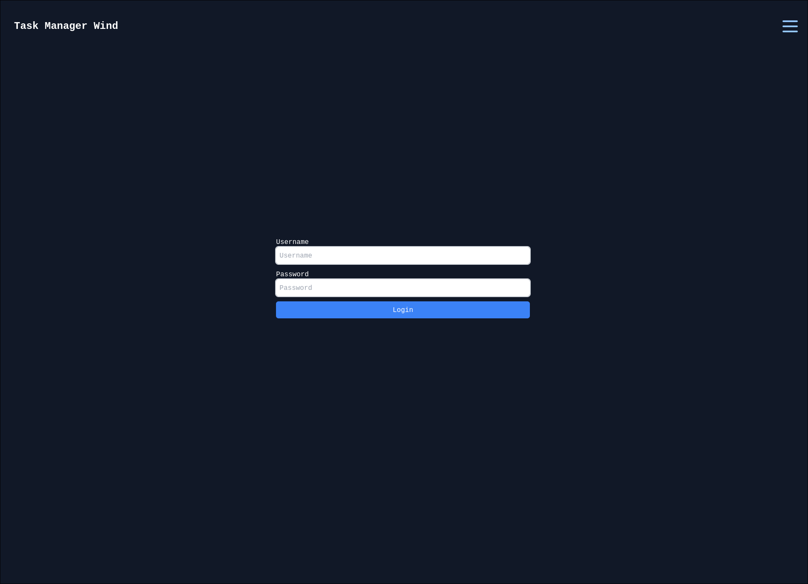
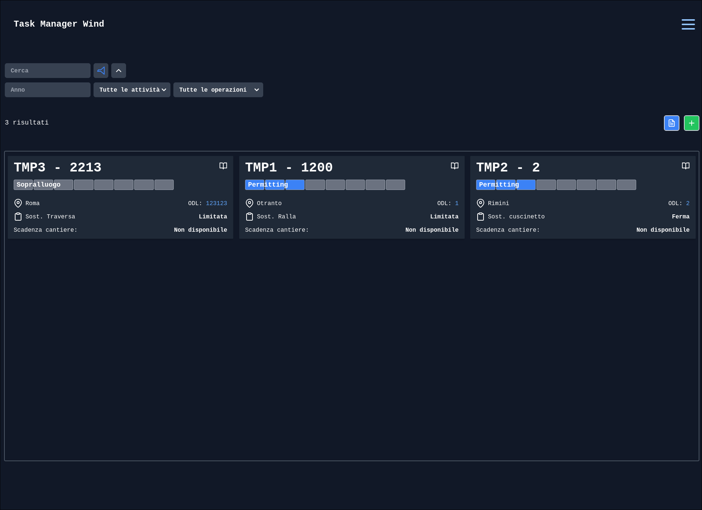
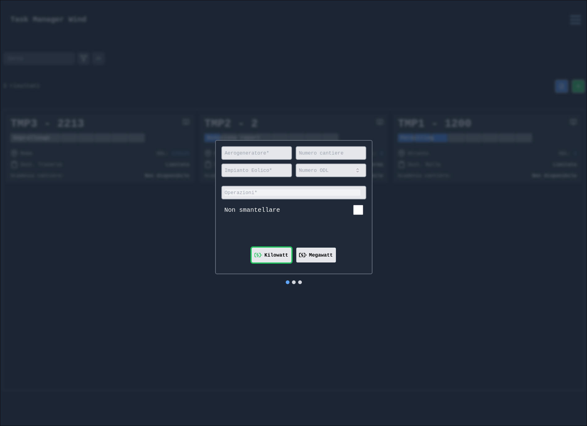
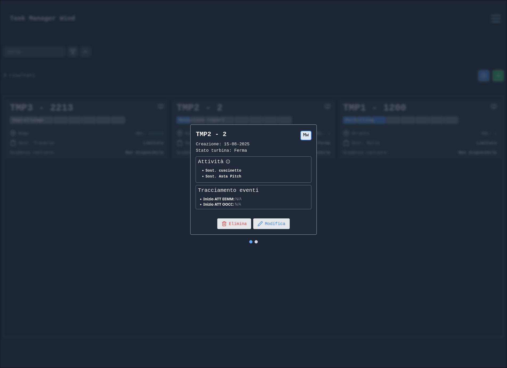
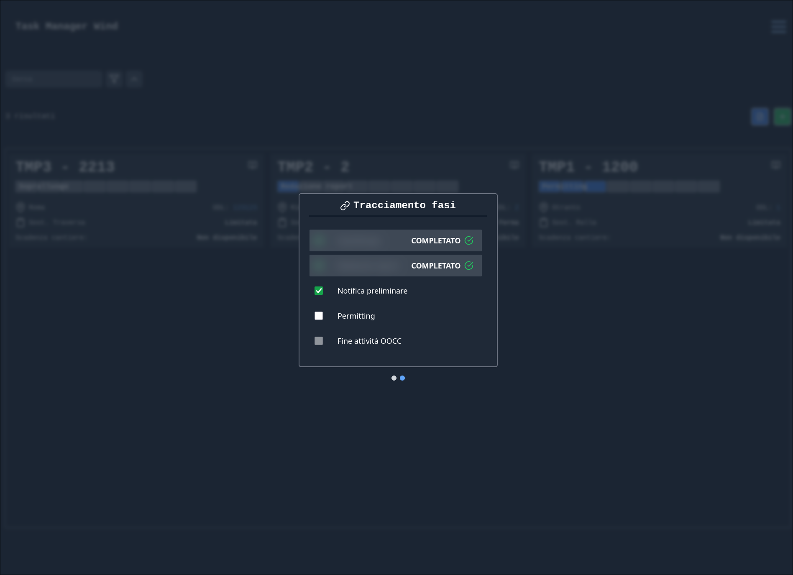

\newpage

# Introduzione

Il presente documento fornisce una guida per l'utilizzo dell'applicazione [WIND](https://simone-lungarella.github.io/winforce2.0). L'applicazione consente di gestire cantieri relativi alla riparazione e alla manutenzione ordinaria e straordinaria di aerogeneratori. 

\newpage

# Specifiche tecniche

## Front-end

L'interfaccia utente è stata realizzata con l'ausilio della libreria [TailwindCSS](https://tailwindcss.com/) e del framework [ReactJS](https://reactjs.org/) ed è stata sviluppata con un approccio *mobile first* e *responsive design*. 

## Back-end

Il back-end è stato realizzato con l'ausilio del framework [SpringBoot](https://spring.io/projects/spring-boot) e del linguaggio di programmazione [Java](https://www.java.com/it/). Il back-end è stato sviluppato con un approccio *RESTful* e consente di gestire le richieste provenienti dall'interfaccia utente.

## Persistenza dei dati

La persistenza è gestita da un database [PostgreSQL](https://www.postgresql.org/) che viene gestito tramite add-on [Heroku Postgres](https://www.heroku.com/postgres). Il database consente di memorizzare i dati relativi agli utenti, ai permessi e ai ruoli, alle attività e ai cantieri e alle relazioni tra questi.

## Autenticazione

L'autenticazione alla piattaforma è vincolata ad un censimento dell'utenza da parte di un amministratore di sistema che, inoltre, può assegnare ruoli e permessi agli utenti. In fase di login, l'utente si autenticherà con le proprie credenziali, da queste verrà generato un token di autenticazione che verrà utilizzato per le successive richieste.

\newpage

# Utilizzo

## Login

L'utente si autentica inserendo le proprie credenziali (username e password). In caso di credenziali errate, l'utente verrà avvisato con un messaggio di errore. In caso di credenziali corrette, l'utente verrà reindirizzato alla pagina principale dell'applicazione.

 

## Pagina principale

La pagina principale dell'applicazione è composta dalla sezione principale che contiene la lista dei cantieri e un set minimale di informazioni rilevanti per ognuno di essi, una sezione superiore che consente l'utilizzo dei filtri e della ricerca e una sezione aggiuntiva che consente operazioni funzionali.

 

### Informazioni principali cantiere

Ogni *card* rappresenta un cantiere e contiene un set di informazioni principali. Le informazioni principali consentono di recuperare il contesto del cantiere e di avere un'idea generale delle sue caratteristiche.

| Informazione                                              | Descrizione                                   |
| --------------------------------------------------------- | --------------------------------------------- |
| Nome aerogeneratore                                       | Nome dell'aerogeneratore                      |
| Numero di cantiere                                        | Numero di cantiere se esistente o **XXXX**    |
| Posizione                                                 | Posizione geografica del cantiere             |
| Numero ODL                                                | Numero dell'ordine di lavoro se disponibile   |
| Operazioni                                                | Operazione principale del cantiere            |
| Stato                                                     | Stato del cantiere                            |
| Scadenza                                                  | Data di scadenza del cantiere se disponibile  |

Dalla *card* è possibile accedere alla pagina di dettaglio del cantiere cliccando sul pulsante *Dettagli* caratterizzato da un'icona a forma di libro aperto.

### Filtri

I filtri consentono di impostare i vari criteri di visualizzazione dei cantieri consentendo un focus sulle informazioni più rilevanti.

Viene sempre mostrato il numero di cantieri visualizzati per consentire maggiore accessibilità.

| Filtro                | Tipologia              | Descrizione                                                                                            | Opzioni                     |
| --------------------  | ---------------------- | ------------------------------------------------------------------------------------------------------ | --------------------------- |
| Anno                  | Testo libero           | Consente di filtrare i cantieri in base all'anno di inizio                                             | -                           |
| Attività              | Combobox               | Consente di filtrare i cantieri in base all'attività                                                   | Tutti, In Corso, Completati |
| Operazioni            | Combobox               | Consente di filtrare i cantieri in base all'operazione                                                 | Tutte, Pale, Main Components, Manutenzioni ordinarie |
| Ordinamento           | Toggle                 | Consente di ordinare i cantieri in base al numero di cantiere in ordine decrescente evidenziando in cima i cantieri senza numero di cantiere | Decrescente, Senza ordinamento |

### Ricerca

La ricerca dei cantieri è possibile inserendo il numero di cantiere, il nome del cantiere o la posizione geografica del cantiere. La ricerca è possibile anche in combinazione con i filtri e qualora non dovesse essere possibile trovare un cantiere con i criteri di ricerca impostati, sarà visibile il messaggio: **0 risultati**.

### Operazioni

Le operazioni funzionali consento di esportare l'insieme di tutti i cantieri e tutte le loro informazioni nel formato *CSV* o di aggiungere un nuovo cantiere.

## Modale di creazione

Per effettuare la creazione di un nuovo cantiere è necessario cliccare sul pulsante **Aggiungi** nella sezione aggiuntiva della pagina principale. Una volta cliccato, verrà visualizzata una modale che permette di inserire le informazioni relative al cantiere. 

Di seguito la lista completa di tutte le informazioni che possono essere definite in fase di creazione o modifica:

| Campo                         | Tipologia                 | Obbligatorio  | Descrizione                                                           | Default   |
| ----------------------------- | ------------------------- | ------------- | --------------------------------------------------------------------- | --------- |
| Aerogeneratore                | Testo libero              | Si            | Nome dell'aerogeneratore                                              | -         |
| Impianto Eolico               | Testo libero              | Si            | Area di riferimento                                                   | -         |
| Numero cantiere               | Testo libero              | No            | Numero di cantiere, tipicamente numerico                              | XXXX      |
| Numero ODL                    | Numerico                  | No            | Numero ODL associato al cantiere                                      | -         |
| Operazioni                    | Lista                     | Si            | Lista delle operazioni da svolgere                                    | -         |
| Non Smantellare               | Toggle                    | No            | Campo informativo relativo alla necessità di smantellamento cantiere  | No        |
| Potenza                       | Radio Button              | Si            | Potenza dell'aerogeneratore                                           | Kw        |
| Stato                         | Radio Button              | Si            | Stato dell'aerogeneratore                                             | In Marcia |
| Data inizio EEMM              | Data                      | No            | Data di inizio EEMM                                                   | -         |
| Data inizio OOCC              | Data                      | No            | Data di inizio OOCC                                                   | -         |
| Validità permitting           | Data                      | No            | Data di inizio di validità permitting                                 | -         |
| Validità notifica             | Data                      | No            | Data di inizio di validità notifica                                   | -         |

A valle dell'inserimento delle informazioni sarà possibile visualizzare un riepilogo delle informazioni inserite e confermare la creazione del cantiere. In caso di annullamento della creazione, sarà possibile chiudere la modale cliccando sul pulsante **Annulla** o utilizzando la funzionalità di *backdrop* che consente di chiudere la modale cliccando fuori dalla modale stessa.

 

### Modale di dettaglio

La modale del dettaglio consente la modifica e l'eliminazione del cantiere e la visualizzazione di due sezioni caratterizzate dalle informazioni relative al cantiere e la lista degli step attraversati dal cantiere.

 

### Informazioni cantiere

La sezione delle informazioni cantiere consente la modifica delle informazioni relative al cantiere. Le informazioni riportate comprendono maggiori dettagli su alcune delle informazioni mostrate nella *card* e altre informazioni aggiuntive.

Di seguito le informazioni sul cantiere mostrate nell'anteprima:

| Informazione                                      | Descrizione                                                                                       |
| ------------------------------------------------- | ------------------------------------------------------------------------------------------------- |
| Nome aerogeneratore                               | Nome dell'aerogeneratore                                                                          |
| Numero di cantiere                                | Numero di cantiere se esistente o **XXXX**                                                        |
| Data creazione                                    | Data di creazione del cantiere                                                                    |
| Tipologia di potenza                              | Tipologia di potenza dell'aerogeneratore (Kw o Mw)                                                |
| Operazioni                                        | Tutte le operazioni del cantiere                                                                  |
| Tracciamento eventi                               | Sezione che consente di visualizzare tutte le date relative ad eventi caratteristici del cantiere |

### Tracciamento fasi

La sezione di tracciamento fasi, raggiungibile con scroll orizzontale o attraverso il click sul secondo punto blu posizionato al di sotto della modale, consente di visualizzare la lista degli step attraversati dal cantiere. 

Ogni step è caratterizzato da una *checkbox* e una breve descrizione, in questa sezione è possibile far avanzare lo stato del cantiere attraverso la selezione delle *checkbox*. L'utente potrà agire solo sullo step raggiunto e su quello precedente facendone avanzare o regredire la percentuale di completamento. Non è possibile l'interazione con gli step successivi allo stato raggiunto per evitare errori di inserimento.

Quando tutti gli step sono completati, il cantiere viene automaticamente considerato completato.

Di seguito tutti gli step da impostare come completi prima che le attività risultino complete.

| Step                                              | Descrizione                                               |
| ------------------------------------------------- | --------------------------------------------------------- |
| Sopralluogo                                       | Sopralluogo del cantiere                                  |
| Redazione Report                                  | Redazione del report di sopralluogo                       |
| Notifica Preliminare                              | Notifica preliminare                                      |
| Permitting                                        | Permitting                                                |
| Fine attività OOCC                                | Fine attività opere civili                                |
| Fine attività EEMM                                | Fine attività EEMM                                        |
| Smontaggio piazzola                               | Fase di smontaggio piazzola                               |
| Chiusura permitting                               | Effettiva chiusura del cantiere                           |

 

## Modale di modifica

La modale di modifica consente la modifica delle informazioni relative al cantiere. Le informazioni modificabili sono le stesse riportate nella modale di creazione. Una volta effettuate le modifiche sarà possibile visualizzare un riepilogo delle informazioni modificate e confermare la modifica del cantiere.

In caso di annullamento della modifica, sarà possibile chiudere la modale cliccando sul pulsante **Annulla** o utilizzando la funzionalità di *backdrop* che consente di chiudere la modale cliccando fuori dalla modale stessa. L'informazione relativa al nome dell'Aerogeneratore non è modificabile in quanto offre un riferimento univoco al cantiere.

## Modale di eliminazione

La modale di eliminazione consente l'eliminazione del cantiere. Una volta confermata l'eliminazione, il cantiere verrà eliminato e non sarà più possibile recuperarlo. 

In caso di annullamento dell'eliminazione, sarà possibile chiudere la modale cliccando sul pulsante **Annulla** o utilizzando la funzionalità di *backdrop* che consente di chiudere la modale cliccando fuori dalla modale stessa.

 

## Logout

La funzionalità di logout consente di effettuare il logout dall'applicazione. Una volta effettuato il logout, l'utente verrà reindirizzato alla pagina di login. Per effettuare il logout sarà sufficiente cliccare sul pulsante **Logout** presente nel menu *hamburger* posto in alto a destra.
